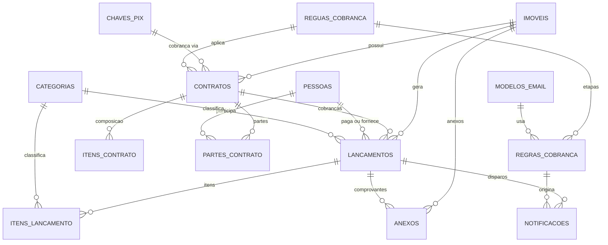

# LocaFácil, Modelagem de Dados

Sistema de gestão imobiliária pessoal: cadastro de imóveis, controle de receitas e despesas
por imóvel, gestão de contratos de locação e régua automatizada de cobrança por e-mail com Pix.

## Sumário

- [Decisões de arquitetura](#decisões-de-arquitetura)
- [Diagrama ER](#diagrama-er)
- [Bloco 1: Patrimônio](#bloco-1-patrimônio)
- [Bloco 2: Financeiro](#bloco-2-financeiro)
- [Bloco 3: Locação](#bloco-3-locação)
- [Bloco 4: Automação](#bloco-4-automação)
- [Bloco 5: Apoio](#bloco-5-apoio)
- [Enums](#enums)
- [Regras de negócio](#regras-de-negócio)
- [Métricas derivadas](#métricas-derivadas)
- [Escopo do v1](#escopo-do-v1)

---

## Decisões de arquitetura

### Stack

| Camada | Escolha | Motivo |
|---|---|---|
| API e agendador | NestJS | Domínio existente do time, `@nestjs/schedule` resolve os crons no mesmo container |
| ORM | Prisma | Migrations versionadas, tipagem forte |
| Banco | MariaDB (CapRover) | Já provisionado |
| Arquivos | MinIO (CapRover) | Upload e download por presigned URL, o arquivo não trafega pela API |
| Front | Next.js | Domínio existente do time |
| E-mail | Microsoft Graph API | Ver alerta abaixo |

### Alerta: envio de e-mail pelo Outlook

A Microsoft desativou **Basic Auth no SMTP AUTH** do Exchange Online. Contas M365 corporativas
não autenticam mais com usuário e senha via `nodemailer` padrão.

O envio deve usar **Microsoft Graph API** (`POST /users/{id}/sendMail`) com OAuth2 client
credentials, ou SMTP com OAuth2. Em qualquer caso, isolar o envio atrás de uma interface
`EnviadorEmail` para permitir troca por Resend, SES ou outro provedor sem tocar no restante
do sistema.

Limites do Exchange Online a considerar: 30 mensagens por minuto e 10.000 destinatários por dia.

### Convenções de nomenclatura

- Tabelas e colunas em **português, sem acento e sem cedilha** (`lancamentos`, não `lançamentos`),
  evitando problemas de collation no MariaDB e no client gerado.
- Tabelas no plural, colunas em `snake_case`.
- Models do Prisma em `PascalCase` singular, mapeados com `@@map` e `@map`.
- Chaves primárias em `uuid`.
- Valores monetários em `decimal(14,2)`. Nunca `float`.
- Exclusão lógica via coluna `arquivado_em` nas entidades de cadastro.

### Decisão central do modelo

**Cobrança e lançamento são a mesma tabela** (`lancamentos`). Uma despesa de reforma é um
lançamento já pago. O aluguel de setembro é um lançamento com `vencimento` e situação
`PENDENTE`. Isso evita duplicar toda a lógica de relatório, conciliação e anexo.

---

## Diagrama ER



---

## Bloco 1: Patrimônio

### `imoveis`

| Campo | Tipo | Nulo | Descrição |
|---|---|---|---|
| `id` | uuid | não | PK |
| `apelido` | varchar(80) | não | Identificação curta, ex. "Ap 302 Centro" |
| `estrategia` | enum `Estrategia` | não | Define quais relatórios se aplicam |
| `situacao` | enum `SituacaoImovel` | não | Estágio no ciclo de vida |
| `tipo` | enum `TipoImovel` | não | |
| `cep` | varchar(9) | sim | |
| `logradouro` | varchar(150) | sim | |
| `numero` | varchar(20) | sim | |
| `complemento` | varchar(80) | sim | |
| `bairro` | varchar(80) | sim | |
| `cidade` | varchar(80) | sim | |
| `uf` | char(2) | sim | |
| `matricula` | varchar(50) | sim | Número da matrícula no cartório |
| `inscricao_municipal` | varchar(50) | sim | Código do IPTU |
| `area_total` | decimal(10,2) | sim | m² |
| `area_construida` | decimal(10,2) | sim | m² |
| `quartos` | int | sim | |
| `vagas` | int | sim | |
| `data_aquisicao` | date | sim | |
| `valor_aquisicao` | decimal(14,2) | sim | Valor de escritura |
| `data_venda` | date | sim | |
| `valor_venda` | decimal(14,2) | sim | |
| `valor_venda_alvo` | decimal(14,2) | sim | Previsto, para comparar com o realizado |
| `aluguel_alvo` | decimal(14,2) | sim | Previsto |
| `observacoes` | text | sim | |
| `criado_em` | datetime | não | |
| `atualizado_em` | datetime | não | |
| `arquivado_em` | datetime | sim | Exclusão lógica |

Índices: `situacao`, `estrategia`, `arquivado_em`.

> O custo total para apuração de ganho de capital **não é uma coluna**. É calculado como
> `valor_aquisicao + SUM(lancamentos.valor WHERE capitalizavel = true)`.

### `pessoas`

Cadastro único para inquilino, fiador, comprador e fornecedor. O papel é definido pelo
relacionamento, não por um campo de tipo.

| Campo | Tipo | Nulo | Descrição |
|---|---|---|---|
| `id` | uuid | não | PK |
| `nome` | varchar(150) | não | |
| `documento` | varchar(18) | sim | CPF ou CNPJ, único quando preenchido |
| `email` | varchar(150) | sim | Destinatário das cobranças |
| `telefone` | varchar(20) | sim | |
| `data_nascimento` | date | sim | |
| `cep`, `logradouro`, `numero`, `complemento`, `bairro`, `cidade`, `uf` | varchar | sim | |
| `observacoes` | text | sim | |
| `criado_em`, `atualizado_em` | datetime | não | |
| `arquivado_em` | datetime | sim | |

Índices: único em `documento`, índice em `email`.

---

## Bloco 2: Financeiro

### `categorias`

| Campo | Tipo | Nulo | Descrição |
|---|---|---|---|
| `id` | uuid | não | PK |
| `nome` | varchar(80) | não | |
| `natureza` | enum `Natureza` | não | `ENTRADA` ou `SAIDA` |
| `categoria_pai_id` | uuid | sim | Hierarquia de um nível |
| `capitalizavel_padrao` | boolean | não | Sugere o valor ao criar o lançamento |
| `codigo_fiscal` | varchar(20) | sim | Referência para o IR |
| `do_sistema` | boolean | não | Impede exclusão das categorias de seed |
| `ativa` | boolean | não | |

**Seed de categorias**

| Natureza | Categorias |
|---|---|
| `SAIDA` | Aquisição, ITBI e Escritura, Reforma/Material, Reforma/Mão de obra, IPTU, Condomínio, Energia, Água, Gás, Seguro, Manutenção, Corretagem, Taxas bancárias, Juros de financiamento, Documentação |
| `ENTRADA` | Aluguel, Reembolso de condomínio, Reembolso de IPTU, Multa e juros, Venda do imóvel, Caução retida |

Capitalizáveis por padrão: Aquisição, ITBI e Escritura, Reforma/Material, Reforma/Mão de obra,
Corretagem, Documentação.

### `lancamentos`

Núcleo do sistema. Representa tanto uma cobrança futura quanto um lançamento já realizado.

| Campo | Tipo | Nulo | Descrição |
|---|---|---|---|
| `id` | uuid | não | PK |
| `imovel_id` | uuid | não | FK `imoveis` |
| `contrato_id` | uuid | sim | FK `contratos`, preenchido nas cobranças de aluguel |
| `categoria_id` | uuid | não | FK `categorias` |
| `pessoa_id` | uuid | sim | FK `pessoas`, pagador ou fornecedor |
| `natureza` | enum `Natureza` | não | Deve coincidir com a da categoria |
| `situacao` | enum `SituacaoLancamento` | não | |
| `origem` | enum `OrigemLancamento` | não | `MANUAL` ou `CONTRATO_AUTOMATICO` |
| `descricao` | varchar(200) | não | |
| `valor` | decimal(14,2) | não | Valor original, sem multa e juros |
| `competencia` | date | não | Mês de referência, sempre dia 01 |
| `vencimento` | date | sim | Nulo em despesas pagas à vista |
| `pago_em` | datetime | sim | |
| `valor_pago` | decimal(14,2) | sim | Total efetivamente recebido ou pago |
| `valor_multa` | decimal(14,2) | não | Default 0 |
| `valor_juros` | decimal(14,2) | não | Default 0 |
| `valor_desconto` | decimal(14,2) | não | Default 0, desconto de pontualidade |
| `capitalizavel` | boolean | não | Entra no custo do imóvel para ganho de capital |
| `forma_pagamento` | enum `FormaPagamento` | sim | |
| `pix_txid` | varchar(25) | sim | Identificador da cobrança no BR Code |
| `pix_payload` | text | sim | BR Code congelado no momento da emissão |
| `observacoes` | text | sim | |
| `criado_em`, `atualizado_em` | datetime | não | |

**Índices**

- `(imovel_id, competencia)`
- `(situacao, vencimento)` para o cron da régua
- `(contrato_id, competencia)` único quando `origem = CONTRATO_AUTOMATICO`, impede geração duplicada
- único em `pix_txid` quando preenchido

### `itens_lancamento`

Decomposição opcional. Usado nas cobranças de aluguel para separar aluguel, condomínio e IPTU.

| Campo | Tipo | Nulo |
|---|---|---|
| `id` | uuid | não |
| `lancamento_id` | uuid | não |
| `categoria_id` | uuid | não |
| `descricao` | varchar(150) | não |
| `valor` | decimal(14,2) | não |
| `ordem` | int | não |

Regra: quando existirem itens, `lancamentos.valor` deve ser igual à soma dos itens. Consistência
garantida na camada de aplicação, dentro de transação.

---

## Bloco 3: Locação

### `contratos`

| Campo | Tipo | Nulo | Descrição |
|---|---|---|---|
| `id` | uuid | não | PK |
| `imovel_id` | uuid | não | FK `imoveis` |
| `situacao` | enum `SituacaoContrato` | não | |
| `data_inicio` | date | não | |
| `data_fim` | date | não | |
| `data_rescisao` | date | sim | Preenchida na rescisão antecipada |
| `dia_vencimento` | tinyint | não | 1 a 31, ajustado ao último dia do mês quando necessário |
| `valor_aluguel` | decimal(14,2) | não | Valor base, sem os itens recorrentes |
| `percentual_multa` | decimal(5,2) | não | Ex. 2.00 |
| `percentual_juros_dia` | decimal(6,4) | não | Ex. 0.0330 |
| `desconto_pontualidade` | decimal(14,2) | não | Default 0 |
| `indice_reajuste` | enum `IndiceReajuste` | não | |
| `intervalo_reajuste_meses` | int | não | Default 12 |
| `proximo_reajuste_em` | date | sim | Alimenta o alerta |
| `tipo_garantia` | enum `TipoGarantia` | não | |
| `valor_garantia` | decimal(14,2) | sim | |
| `chave_pix_id` | uuid | sim | FK `chaves_pix`, se nulo usa a padrão |
| `regua_cobranca_id` | uuid | sim | FK `reguas_cobranca`, se nulo usa a padrão |
| `dias_aviso_encerramento` | int | não | Default 90 |
| `gerar_cobrancas` | boolean | não | Liga e desliga a geração automática |
| `dias_antecedencia_geracao` | int | não | Default 10, quantos dias antes do vencimento gerar |
| `observacoes` | text | sim | |
| `criado_em`, `atualizado_em` | datetime | não | |

Índices: `(imovel_id, situacao)`, `situacao`, `proximo_reajuste_em`, `data_fim`.

Regra: só pode existir **um contrato `ATIVO` por imóvel** com períodos sobrepostos.

### `itens_contrato`

Template dos encargos recorrentes. A cada mês vira `itens_lancamento`.

| Campo | Tipo | Nulo |
|---|---|---|
| `id` | uuid | não |
| `contrato_id` | uuid | não |
| `categoria_id` | uuid | não |
| `descricao` | varchar(150) | não |
| `valor` | decimal(14,2) | não |
| `ativo` | boolean | não |

### `partes_contrato`

| Campo | Tipo | Nulo | Descrição |
|---|---|---|---|
| `id` | uuid | não | PK |
| `contrato_id` | uuid | não | |
| `pessoa_id` | uuid | não | |
| `papel` | enum `PapelParte` | não | `LOCADOR`, `LOCATARIO`, `FIADOR`, `CONJUGE`, `ANUENTE`, `TESTEMUNHA` |
| `contato_principal` | boolean | não | Define quem recebe as cobranças |
| `participacao` | decimal(5,2) | sim | Quota do locador sobre o imóvel. A soma deve fechar 100 |
| `solidario` | boolean | não | Solidariedade presumida pelo art. 2º da Lei 8.245/91 |
| `ordem` | int | não | Ordem de apresentação no preâmbulo do contrato |

Único em `(contrato_id, pessoa_id, papel)`.

---

## Bloco 4: Automação

### `modelos_email`

| Campo | Tipo | Nulo | Descrição |
|---|---|---|---|
| `id` | uuid | não | PK |
| `chave` | varchar(50) | não | Slug único, ex. `cobranca_pre_vencimento` |
| `nome` | varchar(100) | não | |
| `assunto` | varchar(200) | não | Aceita variáveis |
| `corpo_html` | text | não | |
| `corpo_texto` | text | sim | Fallback |
| `variaveis_disponiveis` | json | sim | Apenas documentação para a UI |
| `ativo` | boolean | não | |

**Variáveis de renderização**

| Variável | Conteúdo |
|---|---|
| `{{inquilino.nome}}` | Nome do contato principal |
| `{{inquilino.primeiro_nome}}` | |
| `{{imovel.apelido}}` | |
| `{{imovel.endereco}}` | Endereço formatado |
| `{{cobranca.competencia}}` | Ex. "Setembro/2026" |
| `{{cobranca.vencimento}}` | Formatado dd/mm/aaaa |
| `{{cobranca.valor}}` | Valor original |
| `{{cobranca.valor_total}}` | Com multa, juros e desconto aplicados |
| `{{cobranca.itens}}` | Tabela HTML com a composição |
| `{{cobranca.dias_atraso}}` | |
| `{{cobranca.valor_multa}}` | |
| `{{cobranca.valor_juros}}` | |
| `{{pix.copia_e_cola}}` | Payload BR Code |
| `{{pix.qrcode_url}}` | URL da imagem |
| `{{link_segunda_via}}` | Link público com token |

### `reguas_cobranca`

| Campo | Tipo | Nulo |
|---|---|---|
| `id` | uuid | não |
| `nome` | varchar(100) | não |
| `padrao` | boolean | não |
| `ativa` | boolean | não |

Apenas uma régua pode ter `padrao = true`.

### `regras_cobranca`

Cada etapa da régua. É aqui que a parametrização acontece.

| Campo | Tipo | Nulo | Descrição |
|---|---|---|---|
| `id` | uuid | não | PK |
| `regua_id` | uuid | não | FK `reguas_cobranca` |
| `sequencia` | int | não | Ordem de exibição |
| `dias_offset` | int | não | Negativo antes do vencimento, 0 no dia, positivo em atraso |
| `intervalo_repeticao_dias` | int | sim | Nulo dispara uma vez, 7 repete a cada 7 dias |
| `maximo_repeticoes` | int | sim | Teto de repetições |
| `modelo_email_id` | uuid | não | FK `modelos_email` |
| `hora_envio` | time | não | Default 09:00 |
| `apenas_se_situacao` | enum `SituacaoLancamento` | sim | Filtro adicional |
| `ativa` | boolean | não | |

**Régua padrão sugerida**

| Sequência | Offset | Repetição | Modelo |
|---|---|---|---|
| 1 | -5 | não | Lembrete de vencimento |
| 2 | 0 | não | Vence hoje |
| 3 | +1 | não | Aviso de atraso |
| 4 | +7 | a cada 7 dias, máx. 4 | Cobrança de atraso com multa e juros |

### `notificacoes`

Fila e log de auditoria na mesma tabela.

| Campo | Tipo | Nulo | Descrição |
|---|---|---|---|
| `id` | uuid | não | PK |
| `lancamento_id` | uuid | sim | FK `lancamentos` |
| `contrato_id` | uuid | sim | FK `contratos` |
| `regra_cobranca_id` | uuid | sim | FK `regras_cobranca` |
| `modelo_email_id` | uuid | não | FK `modelos_email` |
| `ocorrencia` | int | não | 1 para o primeiro disparo, incrementa nas repetições |
| `destinatario` | varchar(150) | não | |
| `copia` | varchar(500) | sim | Separado por vírgula |
| `assunto` | varchar(200) | não | Já renderizado |
| `corpo_renderizado` | text | não | Congelado, para auditoria |
| `agendado_para` | datetime | não | |
| `enviado_em` | datetime | sim | |
| `situacao` | enum `SituacaoNotificacao` | não | |
| `tentativas` | int | não | Default 0 |
| `mensagem_erro` | text | sim | |
| `id_provedor` | varchar(200) | sim | Message ID retornado pelo Graph |
| `criado_em` | datetime | não | |

**Índices**

- Único em `(lancamento_id, regra_cobranca_id, ocorrencia)`. É a garantia de idempotência:
  mesmo que o cron rode duas vezes, o inquilino não recebe cobrança duplicada.
- `(situacao, agendado_para)` para o worker de envio.

### `chaves_pix`

| Campo | Tipo | Nulo | Descrição |
|---|---|---|---|
| `id` | uuid | não | PK |
| `tipo_chave` | enum `TipoChavePix` | não | |
| `chave` | varchar(77) | não | |
| `nome_beneficiario` | varchar(25) | não | Limite do padrão BR Code |
| `cidade_beneficiario` | varchar(15) | não | Limite do padrão BR Code |
| `padrao` | boolean | não | |
| `ativa` | boolean | não | |

Geração do BR Code: payload EMV com CRC16-CCITT, `txid` de até 25 caracteres alfanuméricos.
O payload é montado na emissão da cobrança e **congelado** em `lancamentos.pix_payload`, para
que alterações posteriores na chave não invalidem cobranças já enviadas.

---

## Bloco 5: Apoio

### `anexos`

Relacionamento polimórfico, sem FK, apontando para objetos no MinIO.

| Campo | Tipo | Nulo | Descrição |
|---|---|---|---|
| `id` | uuid | não | PK |
| `entidade_tipo` | enum `EntidadeAnexo` | não | `IMOVEL`, `LANCAMENTO`, `CONTRATO`, `PESSOA` |
| `entidade_id` | uuid | não | |
| `especie` | enum `EspecieAnexo` | não | |
| `bucket` | varchar(63) | não | |
| `chave_objeto` | varchar(500) | não | Caminho no MinIO |
| `nome_arquivo` | varchar(255) | não | Nome original |
| `tipo_conteudo` | varchar(100) | não | MIME |
| `tamanho_bytes` | bigint | não | |
| `checksum` | varchar(64) | sim | SHA-256, evita duplicatas |
| `criado_em` | datetime | não | |

Índice em `(entidade_tipo, entidade_id)`.

Convenção de chave no MinIO: `{entidade_tipo}/{entidade_id}/{uuid}-{nome_arquivo}`.

Upload e download sempre por **presigned URL**. Validar MIME e tamanho antes de emitir a URL.

### `configuracoes`

| Campo | Tipo | Nulo | Descrição |
|---|---|---|---|
| `chave` | varchar(80) | não | PK |
| `valor` | text | não | |
| `tipo` | enum | não | `TEXTO`, `NUMERO`, `BOOLEANO`, `JSON` |
| `grupo` | varchar(50) | não | Agrupamento na UI |
| `descricao` | varchar(200) | sim | |

Uso: remetente padrão, fuso horário, dias de aviso de fim de contrato, texto do rodapé dos e-mails.

> Credenciais (SMTP, Graph, MinIO, banco) ficam em variáveis de ambiente, **nunca** nesta tabela.

### `usuarios`

| Campo | Tipo | Nulo |
|---|---|---|
| `id` | uuid | não |
| `nome` | varchar(150) | não |
| `email` | varchar(150) | não, único |
| `senha_hash` | varchar(255) | não |
| `perfil` | enum `PerfilUsuario` | não |
| `ativo` | boolean | não |
| `criado_em`, `atualizado_em` | datetime | não |

Single user no v1, mas o modelo não bloqueia multiusuário depois.

---

## Enums

```prisma
enum Estrategia          { REVENDA LOCACAO TERRENO USO_PROPRIO }
enum SituacaoImovel      { PROSPECCAO ADQUIRIDO EM_REFORMA A_VENDA PARA_ALUGAR ALUGADO VENDIDO }
enum TipoImovel          { APARTAMENTO CASA TERRENO COMERCIAL RURAL }

enum Natureza            { ENTRADA SAIDA }
enum SituacaoLancamento  { PENDENTE PAGO ATRASADO PARCIAL CANCELADO }
enum OrigemLancamento    { MANUAL CONTRATO_AUTOMATICO }
enum FormaPagamento      { PIX TED DINHEIRO BOLETO CARTAO }

enum SituacaoContrato    { RASCUNHO EM_ASSINATURA ATIVO ENCERRADO RESCINDIDO }
enum FinalidadeLocacao   { RESIDENCIAL NAO_RESIDENCIAL TEMPORADA }
enum IndiceReajuste      { IGPM IPCA INCC NENHUM }
enum TipoGarantia        { CAUCAO FIADOR SEGURO_FIANCA TITULO_CAPITALIZACAO NENHUMA }
enum PapelParte          { LOCADOR LOCATARIO FIADOR CONJUGE ANUENTE TESTEMUNHA }
enum EstadoCivil         { SOLTEIRO CASADO DIVORCIADO VIUVO UNIAO_ESTAVEL SEPARADO }

enum SituacaoMinuta      { RASCUNHO GERADA ENVIADA_ASSINATURA ASSINADA CANCELADA }
enum TipoVistoria        { ENTRADA SAIDA PERIODICA }
enum SituacaoVistoria    { RASCUNHO CONVITE_ENVIADO EM_EXECUCAO ENVIADA APROVADA RECUSADA }
enum EstadoItemVistoria  { NOVO BOM REGULAR RUIM AUSENTE NAO_APLICAVEL }
enum TipoEventoVistoria  { CRIADA CONVITE_ENVIADO COMPLEMENTO_SOLICITADO LINK_ABERTO EXECUCAO_INICIADA
                           CONCLUIDA APROVADA AVISO_ENVIADO LAUDO_GERADO LAUDO_ENVIADO LAUDO_ABERTO }
enum OrigemEventoVistoria { PAINEL LINK_PUBLICO SISTEMA }
enum PapelAceiteVistoria { EXECUTOR GESTOR }

enum SituacaoNotificacao { PENDENTE ENVIADO FALHOU IGNORADO CANCELADO }
enum TipoChavePix        { CPF CNPJ EMAIL TELEFONE ALEATORIA }

enum EntidadeAnexo       { IMOVEL LANCAMENTO CONTRATO PESSOA VISTORIA }
enum EspecieAnexo        { COMPROVANTE NOTA_FISCAL CONTRATO FOTO ESCRITURA LAUDO OUTRO }
enum PerfilUsuario       { ADMIN OPERADOR LEITURA }
```

---

## Regras de negócio

### 1. Geração automática de cobranças

Cron diário. Para cada contrato `ATIVO` com `gerar_cobrancas = true`:

1. Calcula o próximo vencimento a partir de `dia_vencimento`, ajustando ao último dia do mês
   quando o dia não existir (ex. dia 31 em fevereiro).
2. Se faltarem `dias_antecedencia_geracao` ou menos, cria o lançamento da competência.
3. Copia `valor_aluguel` e os `itens_contrato` ativos para `itens_lancamento`.
4. Gera `pix_txid` e monta o `pix_payload`.
5. O índice único em `(contrato_id, competencia)` impede duplicação.

### 2. Régua de cobrança

Cron diário. Para cada lançamento `PENDENTE` ou `ATRASADO` com `vencimento` preenchido:

1. Resolve a régua do contrato ou a régua padrão.
2. Para cada regra ativa, calcula `vencimento + dias_offset` e as repetições subsequentes.
3. Se a data calculada é hoje, renderiza o modelo e cria a notificação com
   `situacao = PENDENTE` e `agendado_para = hoje + hora_envio`.
4. Um worker consome notificações pendentes, envia e grava `enviado_em` e `id_provedor`.
5. Falhas incrementam `tentativas` e agendam nova tentativa com backoff. Após 3 falhas,
   `situacao = FALHOU`.

### 3. Baixa de pagamento

Fluxo manual: marcar como pago com upload de comprovante.

1. Exige pelo menos um anexo com `especie = COMPROVANTE` vinculado ao lançamento.
2. Se `pago_em > vencimento`, calcula automaticamente:
   - `valor_multa = valor * percentual_multa / 100`
   - `valor_juros = valor * percentual_juros_dia / 100 * dias_atraso`
3. Se `pago_em <= vencimento` e o contrato tem `desconto_pontualidade`, aplica o desconto.
4. Multa, juros e desconto ficam **no próprio lançamento**, não em lançamentos separados.
5. Todas as notificações `PENDENTE` daquele lançamento passam a `CANCELADO`.
6. `situacao` vira `PAGO`, ou `PARCIAL` se `valor_pago` for menor que o total devido.

### 4. Marcação de atraso

Cron diário move lançamentos `PENDENTE` com `vencimento < hoje` para `ATRASADO`.

### 5. Alertas de contrato

Cron diário verifica e notifica o gestor:

- Contratos com `proximo_reajuste_em` dentro de 30 dias.
- Contratos com `data_fim` dentro de `dias_aviso_encerramento`.

O reajuste em si é **manual**: o sistema avisa e sugere, o usuário informa o índice acumulado
e confirma. Isso evita depender de integração com fonte de índices no v1.

### 6. Custo capitalizável

Lançamentos com `capitalizavel = true` compõem o custo de aquisição do imóvel para apuração
de ganho de capital na venda. O default vem de `categorias.capitalizavel_padrao`, mas pode ser
sobrescrito no lançamento.

---

## Métricas derivadas

Calculadas em serviço ou view, **nunca persistidas em coluna**.

| Métrica | Fórmula | Aplica a |
|---|---|---|
| Custo total | `valor_aquisicao + SUM(lancamentos capitalizáveis)` | Todos |
| Investimento total | `SUM(lancamentos SAIDA pagos)` | Todos |
| Lucro bruto | `valor_venda - custo_total` | Revenda |
| ROI | `lucro_bruto / custo_total` | Revenda |
| Lucro por mês parado | `ROI / meses entre aquisição e venda` | Revenda |
| Receita líquida mensal | `SUM(ENTRADA) - SUM(SAIDA)` no período | Locação |
| Yield líquido anual | `(receita_liquida_12m / custo_total)` | Locação |
| Payback | `custo_total / receita_liquida_mensal` | Locação |
| Taxa de inadimplência | `lançamentos atrasados / lançamentos vencidos` | Locação |
| Vacância | Dias sem contrato ativo no período | Locação |

A métrica **lucro por mês parado** é a mais relevante e a menos calculada no mercado. Ela
transforma "esse flip rendeu 18%" em "rendeu 1,2% ao mês, abaixo do CDI".

---

## Escopo do v1

### Dentro

- Cadastro de imóveis com estratégia e situação
- Cadastro de pessoas
- Lançamentos de entrada e saída com categoria e anexo
- Contratos de locação com itens recorrentes
- Geração automática de cobranças mensais
- Pix estático com txid por cobrança
- Régua de cobrança parametrizável por banco (corpo do e-mail, dias, chave Pix)
- Baixa manual com upload de comprovante
- Dashboard com ROI, yield líquido e inadimplência
- Exportação para o IR

### Fora, deliberadamente

| Item | Motivo |
|---|---|
| Integração bancária e Open Finance | Muita burocracia, pouco retorno inicial |
| Pix cobrança com webhook de baixa automática | Exige PSP homologado, muda o porte do projeto |
| Boleto registrado | Idem |
| Portal do inquilino com login | Link público com token resolve a segunda via |
| CRM, leads, agendamento de visitas | É outro produto |
| Contabilidade com partidas dobradas | Categorias simples bastam |
| Orçado vs. realizado por etapa de reforma | Categoria no lançamento resolve o v1 |
| App mobile nativo | Web responsivo cobre o caso de uso |
| Multi-tenant para imobiliárias | Validar em uso próprio primeiro |
